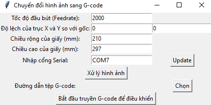
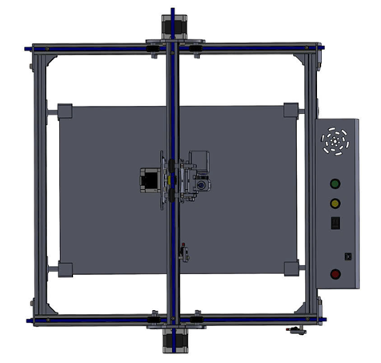
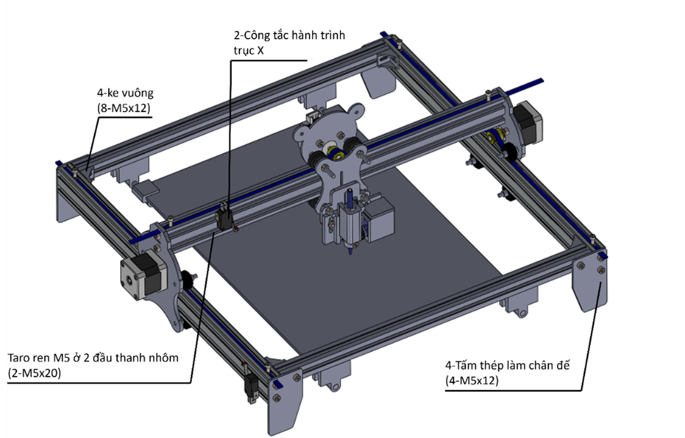
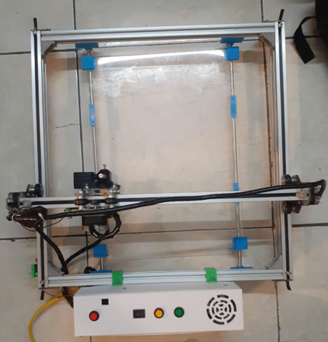

# Create-and-send-gcode-for-CNC-plotter-with-Python
**This source can be useful for you who would like to self study and approach this CNC technology first time**
---
1. Learn to understand how to operate and control the stepper motor and a little about the hardware involved
2. Refer to relate source and read and comprehend each function one by one -> don't hesitate to read because of long code, it's quite easy
3. You can write how machine do follow that you want, if you have knowledges about C/C++
***
## Library
- pyserial
- tkinter
- opencv-python
- matplotlib
## Main feature
- **2Dplottercontroller.ino**: be uploaded on arduino board, It reads data on the serial port, recognizes the format and processes it. It can understand what it has to do next. It then controls actuators like motors and responds by sending a message: "ok" on the serial port when it is done a instruction line.
- **Gcode_sender.py**: Gcode needs to be sent to microcontroller board, this is where it is done. It was designed to have the interface that help you operate easily. it's function is to send a line of gcode every time the microcontroller responds, wait and process responses on keyboard like: pause, stop, up, down, move, test, adjust pen's height,...
- **Process_image_create_and_send_gcode.py**: this code is used to create gcode from image, you can create or choose a available gcode to draw
- **Simple and easy-to-use interface**

## Reference
- https://github.com/MarginallyClever/GcodeCNCDemo
- [uses Bresenham's line algorithm to draw lines and arcs][1]
- [Gctrl - GUI (Graphical User Interface) program for grbl](https://github.com/damellis/gctrl)
  
[1]: https://www.marginallyclever.com/2013/08/how-to-build-an-2-axis-arduino-cnc-gcode-interpreter/
## Model
| |   |
|----------------------------|----------------------------|
 
## Result 
| |   |
|----------------------------|----------------------------|

